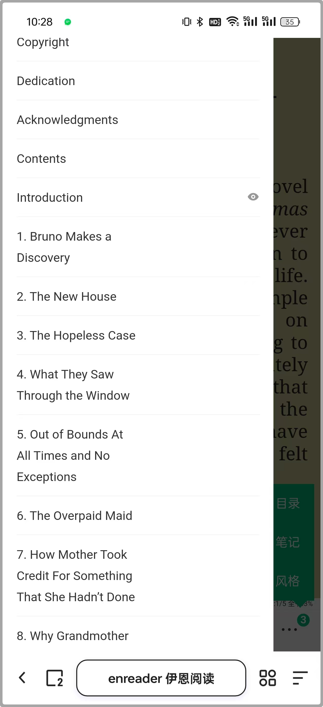
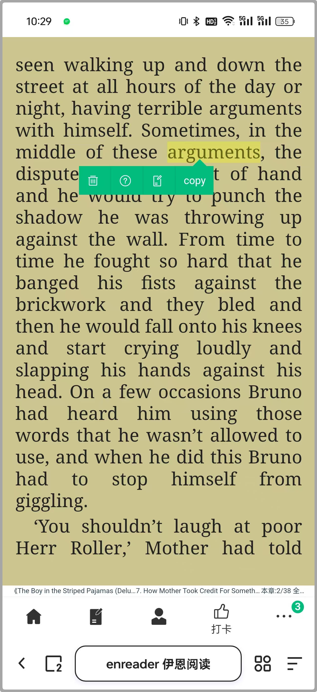
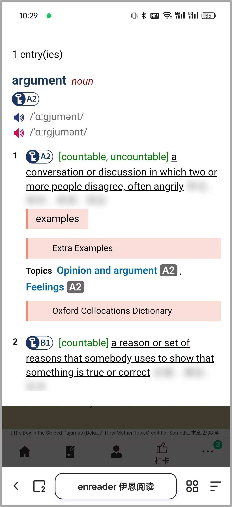
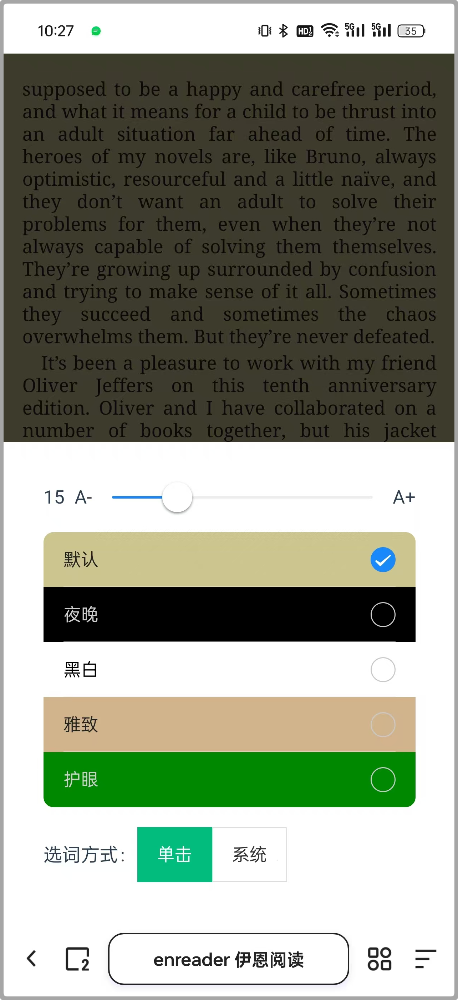

# enreader 伊恩阅读器

一款英文原著阅读器，便于阅读、翻译与记录生词  
https://dominicyuan1024.github.io/enreader/

## ✔文件格式

目前仅支持 epub 格式  
暂不支持其他格式书籍文件，后续会陆续支持

## ✔书架


## ✔阅读

看书、漫画、目录  




## ✔生词本

- 可点选标记书中单词  
  

- 选中单词自动加入笔记并记录句子  
  

## ✔翻译

- 离线词典 《牛津高阶英汉双解词典（第10版）》  
  

- 默认使用马赛克隐藏中文，沉浸于英文阅读，可点击查看中文  
  

## ✔主题设置

- 字体大小、配色  
  

## ✔打卡分享

- 词云  
  

## ✔存储

使用 indexDB、localStorage 存储数据，刷新页面不会丢失，但不同浏览器之间数据无法共享

## Todo

- 支持 pdf 格式
- 根据笔记自动估算词汇量水平
- 单词发音
- 句子朗读
- 句子翻译
- 结合句子上下文精准翻译单词
- 离线应用 pwa

## Project Setup

```sh
npm install
```

### Compile and Hot-Reload for Development

```sh
npm run dev
```

### Compile and Minify for Production

```sh
npm run build
```

## Thanks

[mdict-js](https://github.com/fengdh/mdict-js/)
